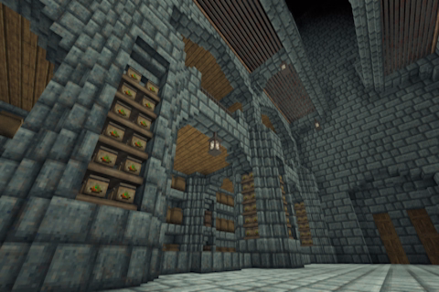

# Mesrune's Folly

Mesrune wanted bigger rooms and custom cellars..!

Size is limited to 32, until further notice ^^'  
Care about multi-chunks rooms : room system ain't designed to allow very big rooms and this mod will break /debug rooms hi/unhi (which I might fix, someday!)  
Also, rooms are registered by chunk : in a multi-chunk room, containers might required you to interact with them to update their state...

---

About the config file (mesrunesfolly.json) :
- MaxRoomSize (default : 14) range => [2; 32] Set maximum room size
- OnlyVolumeForCellar (default : false) If true, room system only cares about cellars' volume, thus cellars' size is limited by MaxRoomSize
- MaxCellarSize (default : 7) range => [2; MaxRoomSize] Sets maximum cellar size
- AlternateMaxCellarSize (default :	9) range => [MaxCellarSize; MaxRoomSize] Sets the maximum length one cellar's dimension can reach : has no effect if lower than or equal to MaxCellarSize
- MaxCellarVolume (default : 150)
	- If "OnlyVolumeForCellar = true", this defines the allowed cellars' volume
	- If "OnlyVolumeForCellar = false" and "AlternateMaxCellarSize > MaxCellarSize", this defines the maximum air volume allowed for a room to be considered a cellar (by default, you can dig 150 blocks in a 7x7x9 cuboid)

Values default to the relevant boundary when out of range!  
All-default-values yield vanilla behavior...

---

Special thanks to :
- Mesrune for the idea and thumbnail :-3
- Meikah for the awesomely artistic thumbnail reshade!

